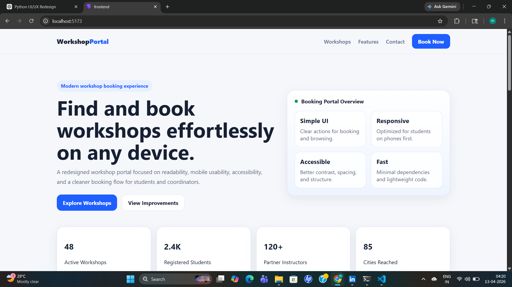
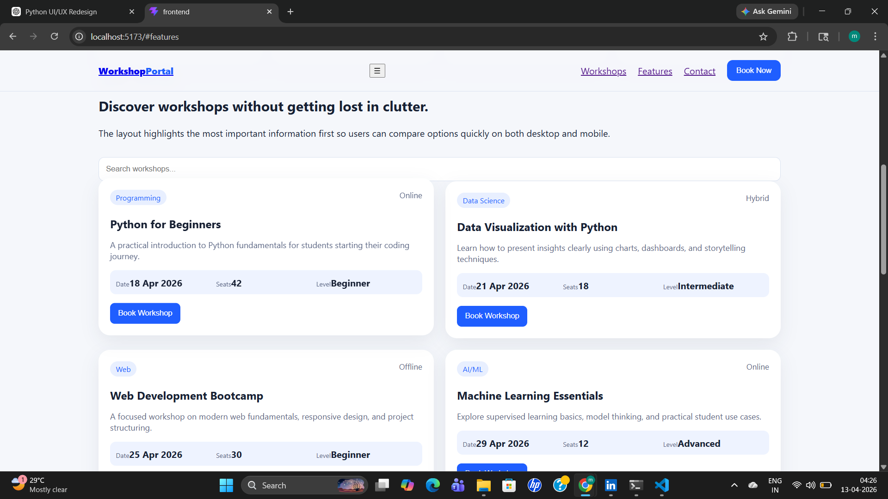
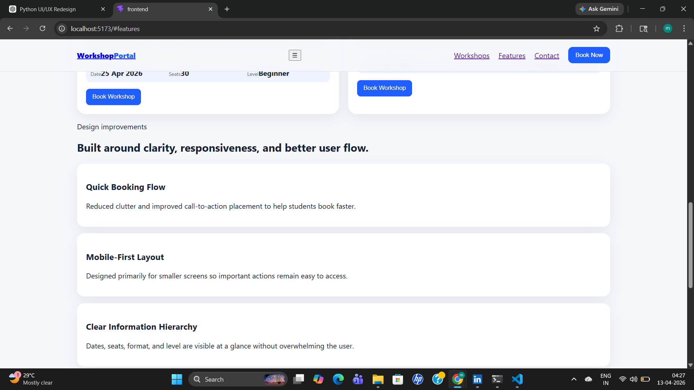
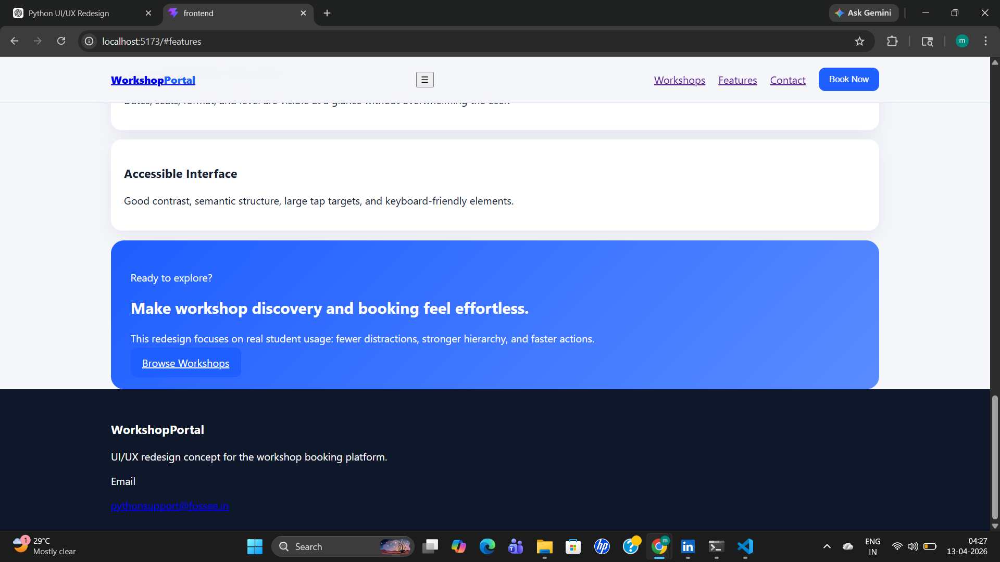
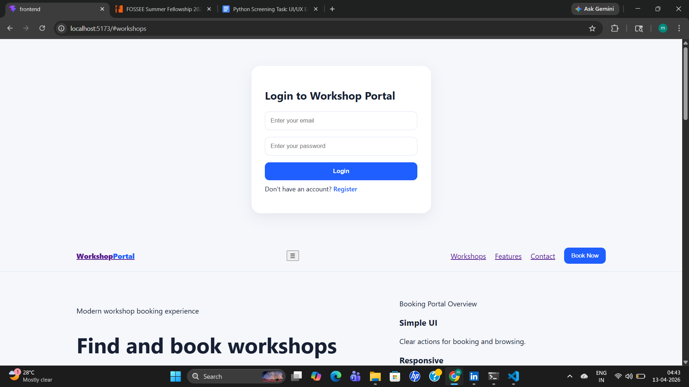

# 🎓 Workshop Booking UI/UX Redesign

## 👨‍💻 Author
**Prajwal Sahu**  
B.Tech CSE (Data Science)  
Shri Shankaracharya Technical Campus, Bhilai  

---

## 📌 Project Overview

This project is a **UI/UX redesign** of the Workshop Booking platform provided by FOSSEE.  
The goal was to improve:

- 📱 Mobile responsiveness  
- 🎯 User experience and navigation  
- 📊 Visual hierarchy  
- ⚡ Performance and simplicity  

The redesigned interface focuses on **clarity, accessibility, and faster booking flow** for students.

---

## 🚀 Features & Improvements

### ✨ 1. Modern Hero Section
- Clear headline and subtext
- Strong call-to-action buttons
- Clean spacing and readability

---

### 📊 2. Statistics Section
- Quick insights (workshops, students, instructors)
- Improves trust and engagement

---

### 📚 3. Workshop Cards UI
- Clean card-based layout
- Key details visible at a glance:
  - Date
  - Seats
  - Level
- Easy comparison between workshops

---

### 🔍 4. Search & Filtering
- Simple search bar
- Helps users quickly find workshops

---

### 📱 5. Mobile-First Design
- Fully responsive layout
- Optimized for small screens
- Easy navigation with proper spacing

---

### 🎯 6. Improved CTA (Call-to-Action)
- Strategically placed buttons
- Encourages quick booking decisions

---

### ♿ 7. Accessibility Improvements
- Better contrast
- Readable fonts
- Semantic structure
- Large clickable areas

---

## 📸 UI Screenshots

### 🏠 Landing Page


---

### 📚 Workshops Section


---

### ✨ Features Section


---

### 🚀 Call-to-Action Section


---

### 🔐 Login Page


---

## 🛠️ Tech Stack

- ⚛️ React (Vite)
- 🎨 CSS
- 📦 JavaScript (ES6+)

---

## ⚙️ Setup Instructions

```bash
# Clone the repository
git clone https://github.com/priyanjall/workshop-ui-redesign

# Go to project folder
cd workshop-ui-redesign

# Install dependencies
npm install

# Run development server
npm run dev
